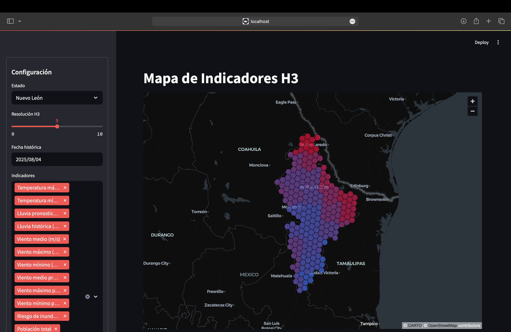
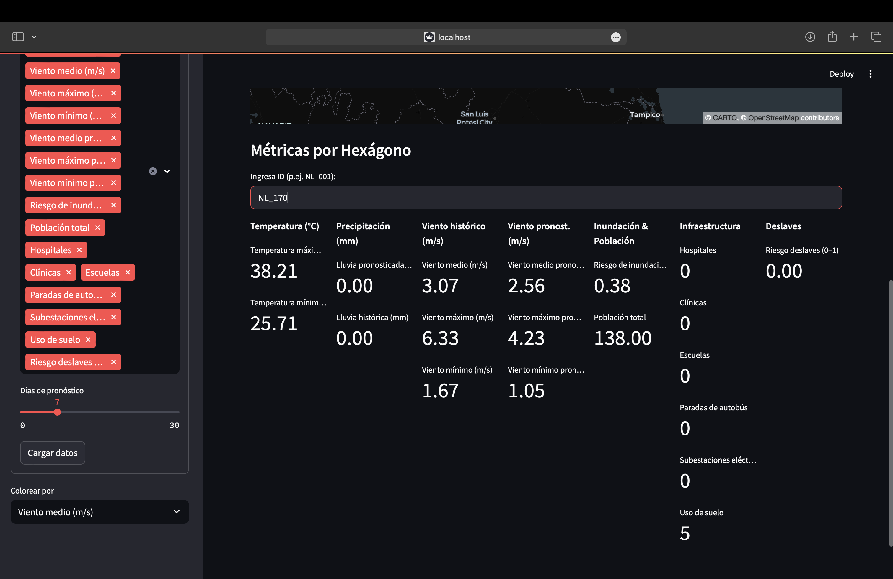
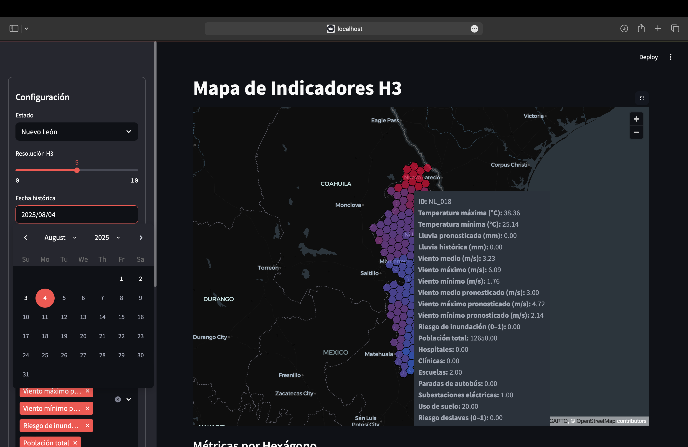

# Ahead of the Storm: Child-Centric Disaster Risk Visualization App

## Introduction

This project is a **data visualization tool designed for climate and disaster forecasting** with a specific focus on child-centered risk analysis, built for the UNICEF "Ahead of the Storm" challenge. The app empowers users to anticipate the impact of extreme weather events—like hurricanes, floods, and landslides—on children and critical infrastructure, facilitating **proactive action** and resource mobilization **before disaster strikes**.

---

## Table of Contents

- [Background & Challenge](#background--challenge)
- [Features](#features)
- [Screenshots](#screenshots)
- [Installation](#installation)
- [Required Data Files](#required-data-files)
- [Usage](#usage)
- [Dependencies](#dependencies)
- [Troubleshooting](#troubleshooting)
- [License](#license)
- [Acknowledgements](#acknowledgements)

---

## Background & Challenge

UNICEF's "Ahead of the Storm" initiative recognizes the need for **child-centered impact assessment** in the face of increasing extreme weather events. Traditional approaches react after disasters, often too late for the most vulnerable children. This app was built to help UNICEF and partners:

- **Assess child exposure to hazards** ahead of time using forecast data.
- Quantify vulnerabilities and risks for children and their access to critical services (schools, hospitals, shelters, etc.).
- Visualize cascading hazards, such as how hurricanes can lead to flooding and landslides.
- Enable **proactive and targeted response** to save lives and minimize suffering.

**Challenge Description:**

> The core task is to develop methodologies and code scripts for child-focused short-term impact and risk assessments. These should quantify the specific vulnerabilities of children to extreme weather events (like hurricanes and their associated effects) to enable proactive, targeted interventions in high-risk areas before disasters occur, rather than reactive responses afterwards.

---

## Features

- **Multi-Hazard Spatial Visualization:**  
  Interactive maps display historical and forecasted climate hazards (temperature, precipitation, wind), as well as secondary risks like floods and landslides.
- **H3 Hexagon-Based Mapping:**  
  Uses H3 spatial indexing to aggregate and display data at different resolutions, making spatial patterns and risk "hotspots" easy to interpret.
- **Child-Focused Indicators:**  
  Integrates population data and critical child infrastructure (hospitals, clinics, schools, bus stops, substations, land use) to show not just where hazards may occur, but who and what is at risk.
- **Flexible Temporal Analysis:**  
  Select historical dates or forecast windows to visualize risk scenarios before, during, or after a potential disaster.
- **Per-Hexagon Detailed Metrics:**  
  Drill down into any hexagonal cell to see detailed hazard and exposure indicators—crucial for micro-targeting of emergency interventions.
- **Multi-Variable Comparison:**  
  Overlay multiple indicators (e.g., temperature, wind, flooding, population) to reveal compounding vulnerabilities, supporting advanced risk and scenario analysis.

---

## Screenshots

### 1. State-Level Hazard Map Configuration

*Select a state, H3 spatial resolution, historical/forecast dates, and hazard indicators. The map displays hazard intensity using hexagonal tiling, allowing instant identification of high-risk zones. This enables users to focus preparedness efforts in areas with the highest potential impact on children and infrastructure.*

---

### 2. Detailed Hexagon Metrics

*Clicking any hexagon shows a detailed breakdown: temperature, precipitation, wind (historic & forecast), flood and landslide risk, population, and infrastructure presence. This supports micro-planning and prioritizing vulnerable communities, ensuring no critical details are missed when planning emergency responses.*

---

### 3. Dynamic Hazard & Infrastructure Overlay

*Hovering over a hexagon reveals all associated hazards and exposure metrics—ideal for scenario exploration, cascading risk analysis, and assessing potential child impact and response needs. This visual feedback helps quickly understand compounding vulnerabilities and critical areas for proactive intervention.*

---

## Installation

1. **Clone this repository:**
   ```bash
   git clone <repo-url>
   cd <repo-folder>
   
2. **Install dependencies:**
   ```bash
   pip install -r requirements.txt

> **Note:**
> This app requires four large data files not included in the repo due to size limits. See [Required Data Files](#required-data-files).

---

## Required Data Files

To run the app successfully, **you must obtain 4 external data files** (details below).
**Place these files in the appropriate folder as instructed by the project owner or documentation.**
If you need help sourcing these files, please contact the maintainer.

*Example (replace with your actual file names and locations):*

* `data/coolr/nasa_coolr_events_point.dbf` — NASA Global Landslide Catalog (GLC)
* `data/osm/mexico-latest.osm.pbf` — Locations of hospitals, clinics, schools, etc.
* `data/population/mex_pop_2025_100m.tif` — 2025 population raster (100 m resolution).

---

## Usage

Once dependencies and data files are in place, launch the app:

```bash
streamlit run app.py
```

* Access the app in your browser at [http://localhost:8501](http://localhost:8501).
* Use the sidebar to configure state, H3 resolution, analysis date, and select one or multiple hazard/impact indicators.
* Explore maps and metrics, identify critical child-focused vulnerabilities, and use results for proactive disaster planning.

---

## Dependencies

Key Python libraries (see `requirements.txt` for full list):

* `streamlit` (web app interface)
* `pandas`, `geopandas` (data processing)
* `pydeck`, `h3` (mapping and spatial analysis)
* `concurrent.futures` (parallel data loading)
* `matplotlib`, `scikit-learn`, `scipy`, `torch` (scientific computing & ML)

---

## Troubleshooting

* **Missing data files:**
  Ensure all required external files are present and correctly placed.

* **Port already in use:**
  Change the Streamlit port with:

  ```bash
  streamlit run app.py --server.port <another-port>
  ```

* **Dependency errors:**
  Double-check your Python version and that all libraries are installed:

  ```bash
  pip install -r requirements.txt
  ```

---

## Acknowledgements

Built for the UNICEF "Ahead of the Storm" challenge, with the goal of protecting children through data-driven, proactive disaster response.
